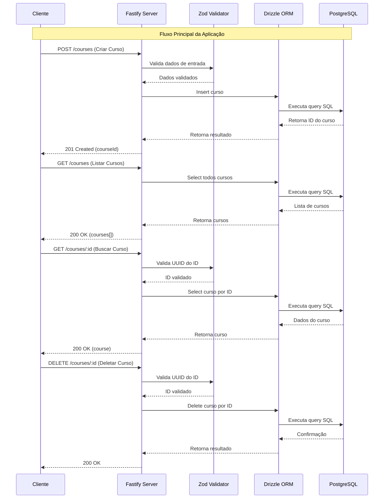

# Node.js API - Desafio

Este é um projeto de API desenvolvido em Node.js como parte de um desafio. A API utiliza Fastify como framework principal e Drizzle ORM para interagir com o banco de dados.

## Funcionalidades

- **Criar Curso**: Endpoint para criar um novo curso.
- **Listar Cursos**: Endpoint para listar todos os cursos.
- **Buscar Curso por ID**: Endpoint para buscar um curso específico pelo ID.
- **Deletar Curso por ID**: Endpoint para deletar um curso específico pelo ID.

## Tecnologias Utilizadas

- **Node.js**: Ambiente de execução JavaScript.
- **Fastify**: Framework web rápido e eficiente.
- **Drizzle ORM**: ORM para interagir com o banco de dados.
- **Zod**: Biblioteca para validação de esquemas.
- **dotenv**: Gerenciamento de variáveis de ambiente.

## Fluxo da Aplicação



## Pré-requisitos

- Node.js v22.18.0 ou superior
- npm (Node Package Manager)

## Instalação

1. Clone o repositório:
   ```bash
   git clone https://github.com/sabinorush/02-nodeJSAPI.git
   ```

2. Navegue até o diretório do projeto:
   ```bash
   cd 02-nodeJSAPI
   ```

3. Instale as dependências:
   ```bash
   npm install
   ```

4. Configure as variáveis de ambiente:
   - Crie um arquivo `.env` na raiz do projeto e adicione as variáveis necessárias.

## Scripts Disponíveis

- **Iniciar o servidor em modo de desenvolvimento**:
  ```bash
  npm run dev
  ```

- **Gerar migrações do banco de dados**:
  ```bash
  npm run db:generate
  ```

- **Aplicar migrações do banco de dados**:
  ```bash
  npm run db:migrate
  ```

- **Abrir o Drizzle Studio**:
  ```bash
  npm run db:studio
  ```

## Endpoints

### Criar Curso
- **POST** `/courses`
- **Body**:
  ```json
  {
    "title": "Nome do Curso"
  }
  ```
- **Resposta**:
  ```json
  {
    "courseId": "uuid-do-curso"
  }
  ```

### Listar Cursos
- **GET** `/courses`
- **Resposta**:
  ```json
  {
    "courses": [
      {
        "id": "uuid",
        "title": "Nome do Curso",
        "description": "Descrição do Curso"
      }
    ]
  }
  ```

### Buscar Curso por ID
- **GET** `/courses/:id`
- **Resposta**:
  ```json
  {
    "course": {
      "id": "uuid",
      "title": "Nome do Curso",
      "description": "Descrição do Curso"
    }
  }
  ```

### Deletar Curso por ID
- **DELETE** `/courses/:id`
- **Resposta**:
  ```json
  {
    "message": "Curso deletado com sucesso"
  }
  ```

## Contribuição

Contribuições são bem-vindas! Sinta-se à vontade para abrir issues e pull requests.

## Licença

Este projeto está licenciado sob a licença ISC.
